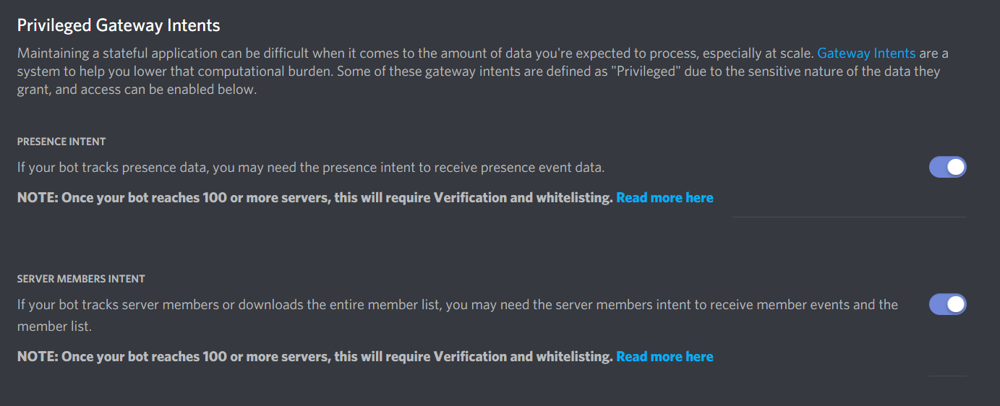

# All In One Discord App

This is a fully customizable, that has ALMOST every Autocode Discord application installed. But after installing this, you need to setup some things for it to work.

# Finishing The Installation Progress

1. Go to [Discord Developer Portal](https://discord.com/developers/applications). 
1. Click On The Application You Want To Give Perms.
1. Click on **bot**, then scroll down. 
1. After scrolling down, turn on the **PRESENCE INTENT** and **SERVER MEMBERS INTENT** 

And your done! This app will do everything it has.

# Purposes of this app

You might be questioning which apps does this app has right? Well then heres the list:

1.  [Simple Bot Prefix Exanple](https://autocode.com/app/threesided/bot-prefix-example/) by threesided. 
1.  [Guild Welcomer](https://autocode.com/app/discord/discord-guild-welcome/) by jacoblee93. 
1.  [Another Welcomer](https://autocode.com/app/bugattiworld/welcomedm/) by lols. 
1.  [Basic Discord Moderator](https://autocode.com/app/discord/basic-discord-moderator/) by ymusleh. 
1.  [Basic Discord Bot Example](https://autocode.com/app/discord/basic-discord-example/) by jacoblee93. 
1.  [/clear Command](https://autocode.com/app/keith/discord-clear-command/) by keithwhor. 
1.  [Advanced Discord Moderation](https://autocode.com/app/harshavarthan/advanced-discord-moderation-bot/) by harshavarthan.
1.  [Random Messager](https://autocode.com/app/threesided/discord-random-messager/) by threesided.
1.  [All In One App]() By R3al Drout.

**YOU, FOR INSTALLING THIS APP INTO YOUR BOT**

# Credits
Credits to:
threesided, jacoblee93, lols, ymusleh, keithwor, harshavarthan, asebolt (and her cute cat), Kangabru, phantom.py 
 **AND YOU**

# Youtube Tutorial

Do you want a youtube tutorial, since you dont like reading? [Click here](https://www.youtube.com/watch?v=t9NbcnIKwRY) for the youtube tutorial

